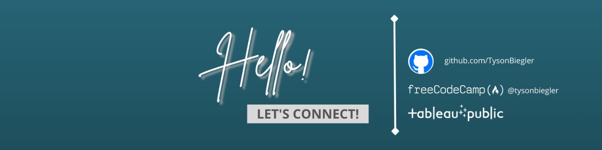
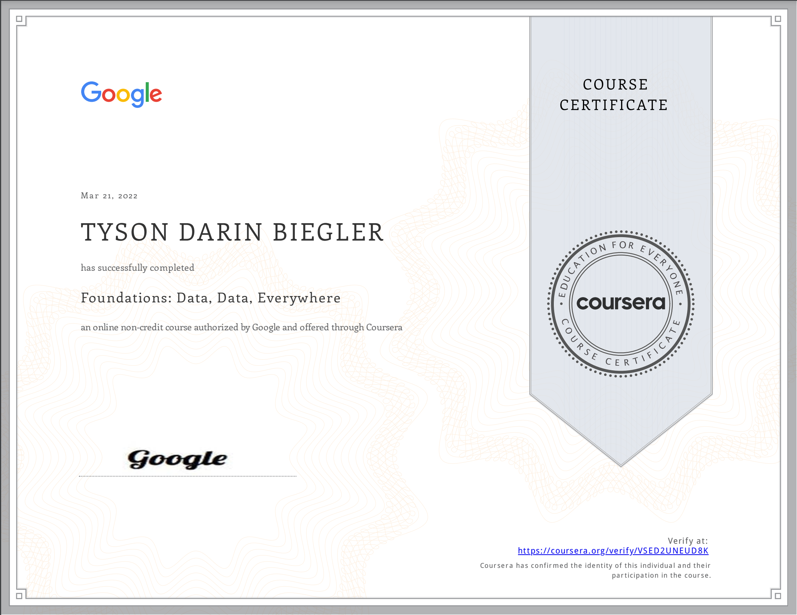
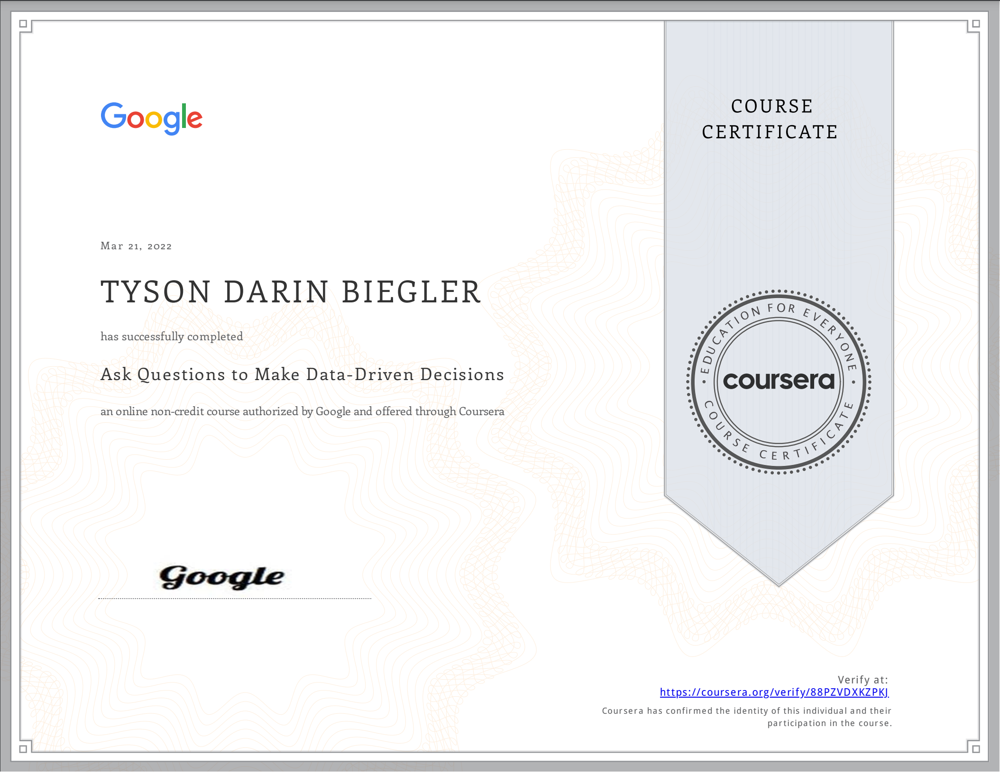
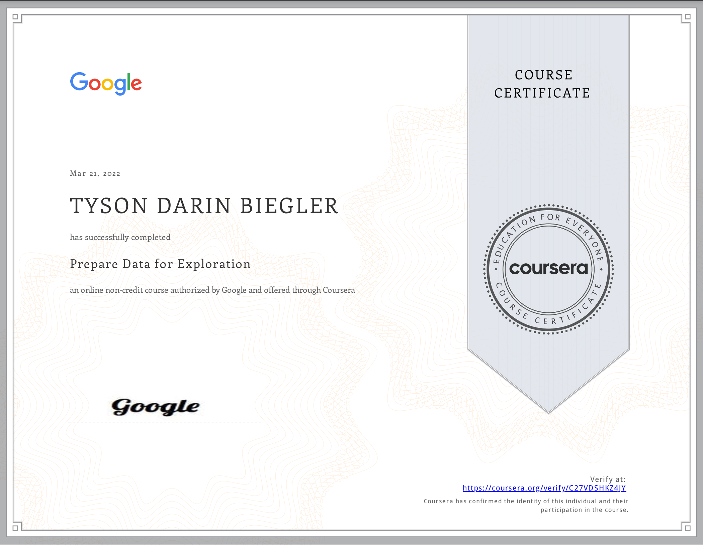
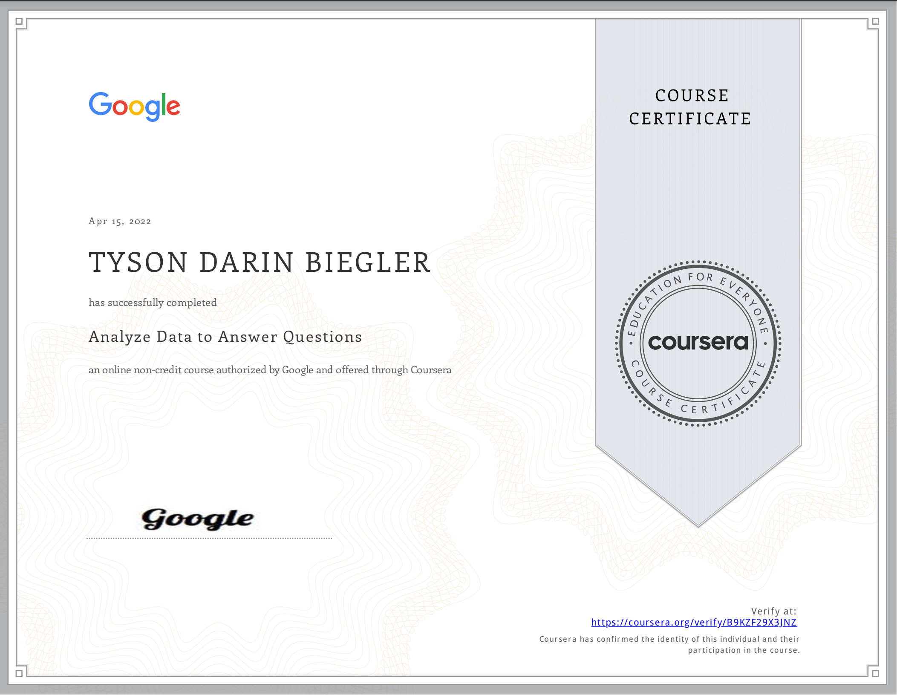
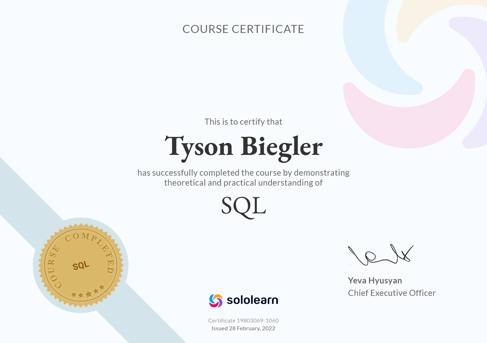
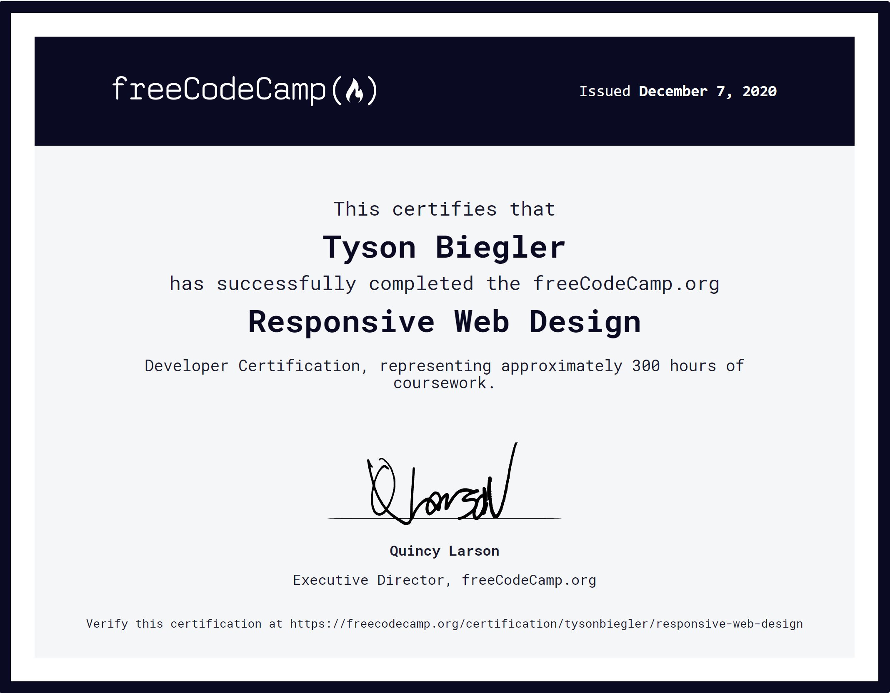
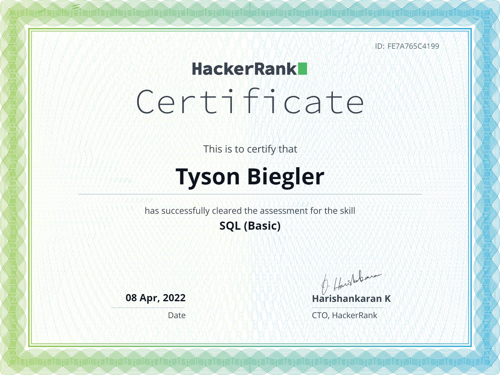

## This line was added to see if i understand how to push to different branches

### Hey, Im Tyson Biegler and this is my
### SQL portfolio.

# Feel free to reach out if you have questions. 
# 

## SKILLS
- 👨‍💻 Web Development 
- 📊 Data analysis 

## CERTIFICATIONS

  |   
------ | -----
  |   
  |   
  |   

## GITHUB STATS
||
|---|---|
